# Customer 360 CDC, Identity & Activation Platform

[](https://github.com/darshil-mangukiya/customer360-cdc-platform/actions/workflows/ci.yml)


**A data engineering system that turns multi-source change events into governed, historical, activation-ready customer profiles.**

Versioned contracts, replay and ordering controls, cross-source identity, SCD2 history, tenant isolation, privacy suppression, and destination idempotency govern the path from captured change to usable customer record. Local runtime validation covers PostgreSQL, Debezium, Kafka, Airflow, and the application stack. Snowflake controls were validated separately, then the warehouse and scheduled objects were suspended.

| Execution summary | Result |
| --- | --- |
| Automated regression | **132 Python tests** passed locally |
| Current transformation graph | **29 models · 2 snapshots · 62 dbt tests · 42 sources · 5 exposures** passed on PostgreSQL; Snowflake parse passed |
| Warehouse migration | **7 reconciled comparisons** with no missing, extra, or mismatched values |
| Orchestration runtime | **20 Airflow tasks across 6 control groups**, including failure, retry, recovery, privacy, and historical runs |
| Real CDC runtime | PostgreSQL WAL → Debezium → Kafka CRUD events, offsets/LSNs, restart recovery, and downstream landing |
| Snowflake-native controls | Stream, Triggered Task, Dynamic Table, RBAC, row access, masking, tags, cost controls, and query history |

## At a glance

The 2026-09-03 bounded local proof captured a **133-row initial snapshot across all six domains**, then accounted for **152 continuous CDC events** with PostgreSQL transaction/LSN and Kafka topic/partition/offset traceability. All 152 were accepted into a clean validation database with zero DLQ records. A controlled same-key `lead → active → inactive` sequence ended at `inactive`; replaying exactly those three offsets produced no duplicate rows.

Identity processing linked **133 distinct source records** into **13 bounded golden customers** (the six-domain scope), with **8 modeled stewardship cases** in the deterministic fixture workflow. dbt produced **10 eligible and 3 suppressed** customers for each of six governed activation exports. Four destination simulators accounted for 48 candidate-dispositions as 39 successes, 8 suppressions, and 1 permanent failure, with zero unexplained variance. All data is synthetic/generated project data.

## Five-minute review

1. Source and topic ownership: [`cdc/source_manifest.yml`](cdc/source_manifest.yml)
2. Source → transaction/LSN → Kafka → persistence: [`CDC_TRACEABILITY.csv`](evidence/runtime/CDC_TRACEABILITY.csv)
3. Snapshot, incremental, and six-domain accounting: [`E2E_SIX_DOMAIN_RECONCILIATION.csv`](evidence/runtime/E2E_SIX_DOMAIN_RECONCILIATION.csv)
4. Ordering and bounded replay: [`ORDERING_EXERCISE.csv`](evidence/runtime/ORDERING_EXERCISE.csv)
5. Identity safety and provenance: [`IDENTITY_RESOLUTION_MATRIX.csv`](identity/validation/IDENTITY_RESOLUTION_MATRIX.csv)
6. dbt privacy authority: [`mart_privacy_activation_eligibility.sql`](dbt/models/marts/mart_privacy_activation_eligibility.sql)
7. Activation accounting: [`ACTIVATION_RECONCILIATION.csv`](activation/validation/ACTIVATION_RECONCILIATION.csv)
8. Cloud boundary: [`SNOWFLAKE_EVIDENCE_STATUS.md`](snowflake/SNOWFLAKE_EVIDENCE_STATUS.md)

## Execution status

| Capability | Status | Boundary |
| --- | --- | --- |
| PostgreSQL WAL, Debezium, Kafka Connect, Kafka | **EXECUTED AND VERIFIED** | bounded local six-domain runtime |
| Normalization, ordering, DLQ, dedup, bounded replay | **EXECUTED AND VERIFIED** | per key/partition; not global ordering |
| Identity, stewardship, survivorship, provenance | **IMPLEMENTED AND TESTED** | stewardship cases are modeled |
| dbt, snapshots, SCD2, privacy eligibility | **EXECUTED AND VERIFIED** | PostgreSQL current graph |
| Six activation exports and reconciliation | **EXECUTED AND VERIFIED** | project-generated local files |
| Four destination adapters | **SIMULATED DESTINATION** | no external SaaS delivery |
| Airflow and FastAPI | **EXECUTED AND VERIFIED** | local runtime/test surfaces |
| Snowflake native features | **RECORDED CLOUD VALIDATION** | 2026-08-22 retained evidence; no cloud access in this upgrade |
| Snowflake parse for current graph | **CONFIGURATION VALIDATED** | 29th privacy model not live-run on Snowflake |
| Terraform | **CONFIGURATION VALIDATED** | blueprint only; never applied |

## Technology stack

| Layer | Technologies and controls |
| --- | --- |
| CDC & event streaming | PostgreSQL WAL, Debezium, Kafka, Kafka Connect, versioned JSON contracts |
| Transformation & warehousing | Python, SQL, dbt Core, dbt-postgres, dbt-snowflake, PostgreSQL, Snowflake, SCD2 ELT |
| Orchestration & serving | Airflow LocalExecutor, FastAPI, Pydantic, Uvicorn |
| Governance & security | PostgreSQL RLS, Snowflake RBAC, row access, masking and tags, tenant-scoped API authorization |
| Quality & operations | pytest, SQLFluff, `pip check`, pip-audit, reconciliation, OpenLineage-style events |
| Delivery | Docker Compose, Make, GitHub Actions |

## The engineering problem

Customer truth rarely lives in one table. Account details, subscriptions, orders, product activity, support history, and marketing consent change independently. A useful Customer 360 must preserve those changes, resolve which records represent the same person, explain how the winning attributes were selected, and prevent an ineligible or cross-tenant record from reaching an activation destination.

This repository treats those concerns as one connected data product rather than a sequence of happy-path scripts. Every stage carries tenant and source context. CDC ingestion records replay and ordering state. Identity decisions remain explainable and reversible. The warehouse exposes both current and point-in-time products. Privacy policy executes before export construction. Destination outcomes reconcile back to the eligible population. Quality, lineage, health, and CI gates make failure visible.

## System architecture

```mermaid
flowchart LR
    subgraph Source["Operational source layer"]
        PG["PostgreSQL<br/>six business domains"]
        Fixture["Deterministic CDC fixtures"]
    end

    PG --> DBZ["Debezium + Kafka Connect"]
    DBZ --> Kafka["Kafka<br/>offsets + source LSNs"]
    Kafka --> Ingest["CDC ingestion<br/>contracts · dedupe · replay · DLQ"]
    Fixture --> Ingest

    Ingest --> Identity["Identity + MDM<br/>matching · stewardship · survivorship"]
    Ingest --> Transform["Shared dbt model graph"]
    Identity --> Transform

    Transform --> Postgres["PostgreSQL marts<br/>current + SCD2 history"]
    Transform --> Snowflake["Snowflake marts<br/>current + SCD2 history"]
    Snowflake --> Native["Stream · Triggered Task · Dynamic Table<br/>RBAC · row access · masking · tags"]

    Postgres --> Privacy["Tenant + privacy gates"]
    Snowflake --> Privacy
    Privacy --> Exports["Activation data products"]
    Exports --> Destinations["Idempotent destination simulators"]
    Destinations --> Reconcile["Reconciliation + drill-down findings"]
    Reconcile --> API["FastAPI data products + operations"]

    Airflow["Airflow control plane"] -. "coordinates guarded stages" .-> Ingest
    Airflow -. "blocks unsafe activation" .-> Privacy
    Observability["Quality · lineage · health · CI"] -. "verifies" .-> Ingest
    Observability -. "verifies" .-> Reconcile
```



Kafka owns continuous event transport; Airflow coordinates batch and control-plane gates. PostgreSQL is the accessible local warehouse, while Snowflake runs the same dbt graph with native governance and incremental processing. The deterministic fixture path supports fast repeatable checks, alongside the separately documented Debezium/Kafka execution.

## Engineering controls

- **Failure-aware CDC.** Normalized envelopes preserve `before`/`after`, operation, source timestamp, schema version, tenant, event hash, replay state, and source metadata. Contract classification, quarantine, duplicate detection, ordering anomalies, watermarks, and checkpoints provide explicit recovery semantics.
- **Explainable identity resolution.** Tenant-scoped identifier nodes, deterministic verified signals, confidence thresholds, and link explanations produce canonical mappings without allowing fuzzy logic to silently mutate identity state.
- **Operational master data management.** Ambiguous matches become stewardship cases. Decisions are transactional and audited; merge and unmerge flows are reversible and idempotent. Golden-record attributes retain field-level provenance and survivorship reasoning.
- **Portable analytical modeling.** A shared dbt graph builds staging, intermediate, current-state, historical, quality, semantic, and export products on PostgreSQL and Snowflake. Adapter-dispatched macros isolate warehouse-specific JSON, timestamp, hashing, and numeric behavior.
- **Privacy before activation.** Consent, unsubscribe, do-not-contact, deletion, identifier availability, and channel eligibility are evaluated before payload construction. Suppression remains reason-coded and independently checked before a destination simulator can run.
- **Operational controls.** Airflow failure injection, CI security gates, source-to-target reconciliation, OpenLineage-style events, freshness metrics, scorecards, health reports, incident scenarios, and runbooks expose the state of guarded stages.

## CDC ingestion and recovery semantics

The ingestion layer converts fixture or Debezium events into one canonical envelope. Schema evolution is classified against versioned contracts: compatible changes can proceed, while breaking removals fail the contract gate. Invalid events are classified and quarantined rather than disappearing into logs. Stable event identifiers, payload hashes, Kafka coordinates, and source LSNs support duplicate detection and deterministic replay. Checkpoints and watermarks make the consumer’s progress inspectable, while replay and out-of-order flags preserve the reason a record was processed.

The local runtime covers PostgreSQL snapshot, insert, update, and delete operations captured from WAL, emitted through Debezium and Kafka Connect, consumed with source offsets and LSNs, and persisted into the raw contract. The current proof adds complete six-domain snapshot/incremental accounting and bounded replay to the earlier restart evidence. See the [runtime manifest](evidence/runtime/runtime_manifest.json), [Kafka and Debezium runtime notes](docs/proof/real_kafka_debezium_execution.md), and [CDC design](docs/cdc_design.md).

## Identity, stewardship, and golden records

Identity resolution is deliberately tenant-safe and conservative. Exact verified signals can form deterministic links; fuzzy scoring produces explainable candidates but never writes authoritative mappings by itself. Confidence bands route uncertain cases to stewardship. The repository supports both deterministic file fixtures and PostgreSQL-backed persistence, where review decisions, merge events, rollback state, and audit metadata share a transaction boundary.

Golden-record construction applies field-level survivorship using source trust, verification, completeness, and recency. Reviewers can inspect why records linked and which source supplied an attribute. An optional assisted-stewardship interface accepts only allowlisted, masked evidence and returns a structured recommendation subject to human review. Its included offline implementation uses deterministic rules and has no authority to merge identities. See [identity resolution](docs/identity_resolution.md) and [master data management](docs/master_data_management.md).

## Warehouse modeling: current truth and historical truth

The dbt project separates ingestion cleanup from business semantics:

- staging models normalize each source domain and CDC shape;
- intermediate models select the latest valid entities and aggregate customer activity;
- marts publish the current Customer 360, masked views, customer health, lifecycle and subscription/order history, pipeline health, identity quality, and activation freshness;
- exports expose purpose-specific, privacy-filtered activation datasets;
- snapshots preserve governed changes alongside event-derived SCD2 facts.

Representative models include [`mart_customer_360_current.sql`](dbt/models/marts/mart_customer_360_current.sql), [`fct_subscription_history.sql`](dbt/models/marts/fct_subscription_history.sql), [`fct_order_history.sql`](dbt/models/marts/fct_order_history.sql), and [`mart_customer_lifecycle_history.sql`](dbt/models/marts/mart_customer_lifecycle_history.sql). Historical records carry validity intervals and source-event lineage, with tests for interval overlap, uniqueness, and tenant boundaries. Late-arriving events and deletes are handled without leaking future state into point-in-time queries. The design is detailed in [warehouse modeling](docs/warehouse_modeling.md).

dbt exposures and the [`data_products.json`](catalog/data_products.json) catalog make ownership and operating expectations explicit: grain, SLA and freshness, contract status, PII classification, consumers, lineage, activation destinations, quality checks, and runbooks.

### PostgreSQL-to-Snowflake portability

PostgreSQL remains the default local target. Snowflake was used as a live second target in the recorded 2026-08-22 validation, when the shared graph contained **28 models, 2 snapshots, and 56 tests**. P7 2.0 now has **29 models and 62 tests**; that current graph passed on PostgreSQL and parsed for Snowflake, but was not live-run there. Compatibility macros handle adapter-specific JSON extraction, timestamp arithmetic, PII hashing, and fixed-point casts while keeping business logic in one model tree.

Value-level migration validation compared canonical customer, Customer 360, subscription history, lifecycle history, order history, activation export, and suppression output. All **7 comparisons** finished with no missing, extra, or mismatched values after semantic normalization of cross-warehouse numeric and null behavior. See the [migration parity report](migration/MIGRATION_PARITY_REPORT.md).

## Snowflake-native engineering

The [`snowflake/sql`](snowflake/sql) modules establish a reproducible control plane around dbt-owned modeled relations: least-privilege roles and grants, an auto-suspending warehouse, prepared schemas, audit objects, external-source contracts, Stream and Triggered Task CDC handling, a Dynamic Table, governance policies and tags, and cost/query observability.

Live validation covered bootstrap and dbt execution, Stream consumption, Triggered Task behavior, incremental Dynamic Table refresh, role separation, tenant row access, PII masking, governance tags, query history, a resource monitor, and warehouse auto-suspend. The final checked state is **Dynamic Table suspended, warehouse suspended, and Triggered Task suspended**. Details are in the [Snowflake validation matrix](docs/proof/snowflake_validation_matrix.md), [cost and performance report](docs/COST_AND_PERFORMANCE_REPORT.md), and [Snowflake runbook](snowflake/README.md).

## Privacy, tenant isolation, and API authorization

Tenant context is part of identity keys, warehouse models, activation exports, and API principals. Selected PostgreSQL tables use row-level security tied to owner-controlled role bindings; tests authenticate as non-owner roles and exercise read and write isolation. Snowflake validation separately demonstrated row-access and masking behavior under restricted roles.

Only `/health` is public in the FastAPI service. Data routes require an API-key principal with explicit scopes and server-configured tenant access. Request parameters may narrow that access but cannot widen it; direct foreign-tenant identifiers are not disclosed. Interactive API documentation is disabled by default. Local mode supplies a wildcard principal for offline runs; configured environments load managed principals from `API_PRINCIPALS_JSON`. See the [API authorization matrix](docs/API_AUTHORIZATION_MATRIX.md) and [privacy governance](docs/privacy_governance.md).

Deletion requests create an audit record and immediately suppress activation. Physical handling of retained CDC or legal history depends on the deployment's retention, tokenization, approval, and legal policies.

## Activation, idempotency, and reconciliation

The platform publishes **6 activation data products** for campaign targeting, customer segment, churn risk, lifecycle stage, customer health, and support priority. Before payload construction, the privacy policy rejects ineligible customers and records a reason. Local destination adapters exercise stable idempotency keys, payload hashing, retries, skips, and per-row failure tracking.

Reconciliation proves that the considered warehouse population balances across successful, failed, suppressed, skipped, and duplicate dispositions. It also produces customer-level findings for missing eligible rows, unexpected exports, privacy leakage, tenant mismatches, duplicate customers or idempotency keys, and missing hashed identifiers. Curated UAT traces business rules from source fields through transformation, policy, export, and validation. See [reverse ETL design](docs/reverse_etl_design.md) and [activation reconciliation](docs/activation_reconciliation.md).

## Orchestration, observability, and CI/CD

The `customer_360_cdc_platform` DAG runs under Airflow LocalExecutor with **20 tasks across 6 control groups**: source readiness, CDC validation, identity/model validation, quality, privacy/activation, and observability. Runtime coverage includes a complete success path; a breaking-contract failure that retried and blocked downstream activation; recovery and idempotent rerun; an explicit historical logical-date run; and an independent privacy gate. See [Airflow runtime notes](docs/proof/AIRFLOW_RUNTIME_EVIDENCE.md).

Observability outputs include freshness and pipeline metrics, weighted quality scorecards, OpenLineage-style events, a consolidated health report, a repeatable benchmark harness, and controlled incident scenarios.

The normal GitHub Actions workflow defines **4 credential-free jobs** covering Python/API dependency security and tests, CDC/pipeline contracts and privacy checks, dbt/SQL/documentation validation, and repository/Compose hygiene. The dynamic badge reports current workflow status. Live Snowflake checks are isolated in a separate, manually dispatched protected-environment workflow so pull requests never receive cloud credentials.

## Verification matrix

| Capability | Status | Primary evidence |
| --- | --- | --- |
| Deterministic end-to-end smoke path | Automated in CI | [`Makefile`](Makefile), [`run_local_pipeline.py`](scripts/run_local_pipeline.py) |
| Python behavior and security boundaries | **132 tests passed** | [`tests/`](tests), [normal CI workflow](.github/workflows/ci.yml) |
| Real PostgreSQL → Debezium → Kafka CDC | Executed locally | [runtime evidence](docs/proof/real_kafka_debezium_execution.md) |
| PostgreSQL dbt build | Executed and tested | [warehouse design](docs/warehouse_modeling.md) |
| Snowflake dbt build and native controls | Executed and recorded | [validation matrix](docs/proof/snowflake_validation_matrix.md) |
| Cross-warehouse value parity | **7/7 comparisons passed** | [parity report](migration/MIGRATION_PARITY_REPORT.md) |
| Airflow scheduler behavior | Executed with success and failure scenarios | [runtime evidence](docs/proof/AIRFLOW_RUNTIME_EVIDENCE.md) |
| Tenant-aware API authorization | Automated and documented | [authorization matrix](docs/API_AUTHORIZATION_MATRIX.md) |
| Privacy-safe activation and reconciliation | Automated and documented | [reconciliation design](docs/activation_reconciliation.md) |

## Quick start

The fast path runs from deterministic local files. It requires no Snowflake account, Kafka broker, or SaaS credential.

```bash
git clone https://github.com/darshil-mangukiya/customer360-cdc-platform.git
cd customer360-cdc-platform
python3 -m venv .venv
source .venv/bin/activate
python -m pip install -r requirements-dev.txt
make smoke
pytest -q
```

`make smoke` generates CDC events, validates and lands raw records, resolves identity, builds Customer 360 artifacts, applies privacy policy, creates activation exports, simulates destination outcomes, and validates the result. Useful focused checks include:

```bash
make contract-gate
make validate
make reconcile
make docs-check
```

Optional service workflows are documented in the [operational runbooks](docs/runbooks/README.md). PostgreSQL/dbt, Kafka/Debezium, Airflow, and Snowflake use separate runtime paths so each dependency can be started and checked independently. Privacy-deletion examples use non-sensitive tenant and customer values.

## Repository map

```text
airflow/               DAG and controlled failure fixture
api/                   scoped Customer 360 and operations API
connect/               Debezium and Snowflake connector templates
contracts/             versioned CDC contracts and compatibility gate
data_generation/       deterministic sources and drift scenarios
dbt/                   shared models, tests, snapshots, macros, exposures
identity_resolution/   matching, stewardship, survivorship, audit
ingestion/             normalization, landing, replay, DLQ, checkpoints
migration/             PostgreSQL-to-Snowflake mapping and parity checks
observability/         metrics, lineage, quality, health, incidents
privacy/               consent, suppression, deletion workflow, PII helpers
reverse_etl/           export products, simulators, reconciliation
snowflake/             bootstrap, native controls, governance, runbook
tests/                 unit, integration, authorization, and UAT coverage
warehouse/sql/         PostgreSQL schemas, tables, and RLS policies
```

## Design decisions and trade-offs

| Decision | Reason | Operational implication |
| --- | --- | --- |
| Keep deterministic fixtures beside streamed CDC | CI remains independent of service availability | Deployed event retention and schema management must be selected for the target environment |
| Share one dbt graph across warehouses | Portability defects become visible in code and value reconciliation | Adapter macros add complexity and each target still needs independent performance tuning |
| Separate continuous transport from Airflow | Kafka handles event flow; Airflow owns bounded gates and batch products | A deployed orchestrator needs alert routing, durable metadata, and a backfill policy |
| Require review for ambiguous identity | Protects customer truth from opaque or probabilistic merges | An operating stewardship team needs SLAs, assignment queues, and access controls |
| Use local destination adapters | Exercises idempotency, retries, privacy, and reconciliation | External connectors add OAuth, rate-limit handling, schema mapping, and destination read-back |
| Gate Snowflake behind manual protected CI | Keeps cloud secrets and spend away from routine pull requests | Scheduled execution requires an approved environment and budget-aware cadence |

## Runtime scope

| Component | Runtime status |
| --- | --- |
| Deterministic local platform | Implemented and exercised by normal CI |
| PostgreSQL/Debezium/Kafka | Executed locally with CRUD and restart recovery |
| PostgreSQL and Snowflake dbt targets | Executed and value-reconciled from shared fixture inputs |
| Snowflake native objects | Live-validated; compute and scheduled objects left suspended |
| Airflow | Scheduler and webserver executed with LocalExecutor |
| Reverse ETL | Local destination adapters |
| Kafka → Snowflake connector | Configuration template; runtime requires the connector plugin and key-pair credentials |
| Provisioning | Terraform blueprint for Snowflake resources |

## Technical deep dives

- [Architecture overview](docs/architecture_overview.md)
- [CDC design and replay](docs/cdc_design.md)
- [Identity resolution](docs/identity_resolution.md)
- [Master data management](docs/master_data_management.md)
- [Warehouse modeling](docs/warehouse_modeling.md)
- [Privacy governance](docs/privacy_governance.md)
- [Reverse ETL design](docs/reverse_etl_design.md)
- [Data quality and observability](docs/data_quality_observability.md)
- [Environment promotion](docs/environment_promotion.md)
- [Operational runbooks](docs/runbooks)

## Engineering outcomes

The implemented controls preserve change semantics, explain identity decisions, model current and historical customer truth, reconcile warehouse migration results, enforce tenant and privacy boundaries, and block unsafe activation. Each major claim above links to its implementation or runtime evidence.

Licensed under the [MIT License](LICENSE).
