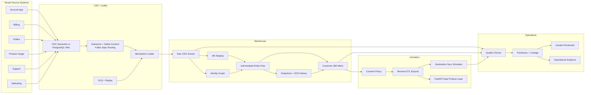

# Architecture Overview

This project is a warehouse-first Customer 360 and activation platform for a SaaS or subscription ecommerce company. It models how operational customer changes move from source systems into a governed warehouse, become canonical customer intelligence, and are activated back into operational tools.

## Design Principles

- Preserve raw CDC before business logic.
- Make every record tenant-aware.
- Keep identity resolution deterministic and explainable.
- Separate staging, intermediate, mart, and activation layers.
- Treat reverse ETL outputs as data products with contracts.
- Keep executed infrastructure, offline fixtures, and external-service boundaries explicit.

## End-To-End Flow

## Multi-Tenant Design

`tenant_id` is present from generation through activation:

- source payloads
- CDC envelopes
- raw landing
- identity graph and canonical customers
- dbt staging and marts
- activation exports
- API filtering
- freshness and pipeline health

The project uses shared schemas with tenant-aware data keys. Identity graph records,
canonical IDs, mappings, facts, history, exports, and API filters are tenant-scoped.
PostgreSQL enforces selected-table RLS through authenticated tenant roles. Snowflake
enforces a live Row Access Policy and email/phone masking on the Customer 360 mart;
strict tests disabled secondary roles and proved analyst, steward, and activator
boundaries.

## Runtime scope

- deterministic CDC generator
- executed local PostgreSQL/Debezium/Kafka path and a separate deterministic generator
- PostgreSQL warehouse
- live Snowflake C360 database, shared dbt graph, Stream/Task, one Dynamic Table,
  RBAC/policies/tags, and cost controls
- CSV/JSON activation artifacts
- local destination responses

The Kafka → Snowflake sink is configuration-only. Its runtime requires the Snowflake
connector plugin and key-pair environment variables.
